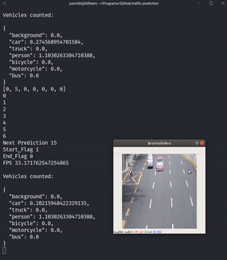

# Traffic Prediction


This repository showcases an algorithm based on moving weighted averages that approximates the future green-time for traffic signals. The research paper published on the same can be found [here](http://ijai.iaescore.com/index.php/IJAI/article/view/17497).

The SSD300 model used for this project is derived from [pierluigiferrari/ssd_keras](https://github.com/pierluigiferrari/ssd_keras). The base model is modified to have only 7 object classes and the weights pre-trained on MS COCO data set are sub-sampled to extract weights for specific vehicle classes.


## Prerequisites

- Tensorflow
- Keras
- OpenCV
- numpy

Download the [.h5 model](https://drive.google.com/file/d/1_GlbaKfDloQDQWDhiecFhxsZ1Jl5uYt5/view?usp=sharing) and place it in the root directory


## Run

```bash
python process.py
```


------

This algorithm uses a few hyper-parameters that can be approximated by considering the vehicle and acceleration profiles of different vehicles. The most important parameter is the "Optimal Processing Time" or OPT, which is an estimate of how long a vehicle takes to cross the field of view of the camera that is mounted on the traffic signal. This camera angle is optimal for this algorithm as it gets the best view of the vehicles and detects them with higher accuracy.

<p align="center">
  
</p>

This approach has its own limitations that are inherent with any image-processing algorithm, but attempts to give a basis to solve the traffic problem by using minimal hardware/ compute resources.


## Videos

Other video sources that this algorithm is tested on and their processed results can be found [here](https://drive.google.com/drive/folders/1PTmL8LCxp4DmLYK7GcP-5e0X-9JCEcm8?usp=sharing)

These videos are:

- [Rush hour intersection traffic condensed into one minute](https://www.youtube.com/watch?v=ufK2XRGUjuc) by [Proboknet: пробки, машины, транспорт, пешеходы, авто](https://www.youtube.com/channel/UCV4CO1uAUm_R32l0L3LM12Q)
- [2.1M Full HD 1080P CCTV Footage](https://www.youtube.com/watch?v=WxgtahHmhiw&feature=youtu.be) by [Cisco C](https://www.youtube.com/channel/UCxtXzhgvN5kxcyojniWhWtg)
- [Australian Trucks : Trucking on the Hume Highway Part 8](https://www.youtube.com/watch?v=oUOmFcyOsKk) by [emd645e3c](https://www.youtube.com/channel/UCZey2WxImVbUSMXe6WnvLlA)